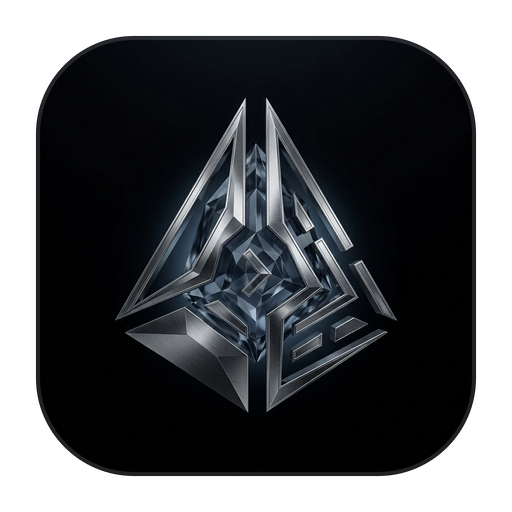

# NoonFlow

<p align="center">
  
</p>

<p align="center">
  <b>Native Desktop GUI for Claude Code & Codex CLI</b>
</p>

<p align="center">
  A visual interface for AI-powered coding workflows
</p>

<p align="center">
  <a href="./README_CN.md">简体中文</a> | English
</p>

---

## Features

- **AI Support** — Currently: Claude (Anthropic), Codex (OpenAI). Architecture ready for more providers
- **Desktop-Native Experience** — Built with Electron for macOS (Windows/Linux coming soon)
- **Integrated Terminal** — Built-in terminal powered by node-pty and xterm.js
- **MCP Plugin System** — Manage Model Context Protocol servers and plugins
- **Session Management** — Persistent chat history with SQLite storage
- **Cost Tracking** — Monitor your API usage and spending
- **Worktree Support** — Git worktree integration for branch-based workflows
- **Skills Marketplace** — Browse and install community skills

## Tech Stack

- **Frontend**: Next.js 16 + React 19 + TypeScript
- **Desktop**: Electron 33
- **Styling**: Tailwind CSS 4 + Radix UI
- **Terminal**: node-pty + xterm.js
- **Database**: better-sqlite3
- **AI SDK**: @anthropic-ai/claude-agent-sdk, @openai/codex-sdk

## Installation

### Download Prebuilt App (Recommended)

Download the latest release from the [Releases](https://github.com/heyallencao/NoonFlow/releases) page.

### Build from Source

**Prerequisites:**
- Node.js 20+
- npm 10+
- macOS (for macOS builds)

```bash
# Clone the repository
git clone https://github.com/heyallencao/NoonFlow.git
cd NoonFlow

# Install dependencies
npm install

# Build native modules
npm run native:ensure

# Start development mode
npm run electron:dev
```

## Development

### Available Scripts

```bash
# Development
npm run dev              # Start Next.js dev server
npm run electron:dev     # Start Electron in development mode

# Building
npm run build            # Build Next.js production bundle
npm run electron:build   # Build Electron app for current platform

# macOS-specific builds
npm run electron:build:mac:arm64           # Build signed app for Apple Silicon
npm run electron:build:mac:x64             # Build signed app for Intel Macs
npm run electron:build:mac                 # Build signed app for current architecture
npm run electron:build:mac:release         # Build notarized release for current architecture

# Testing
npm run lint             # Run ESLint
npm run electron:smoke   # Run smoke tests
```

### Development Environment Strategy

NoonFlow now recommends a single-root environment strategy: keep the main repo as the only baseline install, then let worktrees reuse that dependency set while keeping a local `node_modules` inside each worktree.

For repeatable builds, install dependencies from the repository root and rebuild Electron native modules after dependency or Electron version changes.

### Project Structure

```
NoonFlow/
├── electron/           # Electron main process
│   ├── main.ts        # Main entry
│   ├── handlers/      # IPC handlers
│   ├── server.ts      # Static file server
│   └── icons/         # App icons
├── src/               # Next.js frontend
│   ├── app/           # App Router pages
│   ├── components/    # React components
│   ├── hooks/         # Custom hooks
│   └── lib/           # Utilities
├── scripts/           # Build scripts
├── docs/              # Documentation
└── build/             # Build outputs
```

## Configuration

### API Keys

NoonFlow requires API keys for AI providers. Set them in the Settings page:

- **Anthropic** — Get your key from [console.anthropic.com](https://console.anthropic.com)
- **OpenAI** — Get your key from [platform.openai.com](https://platform.openai.com)
- **Google** — Get your key from [aistudio.google.com](https://aistudio.google.com)

### MCP Servers

Configure MCP (Model Context Protocol) servers in Settings > Plugins. NoonFlow supports:
- Custom MCP servers
- Built-in tools (file system, terminal, etc.)

## Contributing

1. Fork the repository
2. Create your feature branch (`git checkout -b feature/amazing-feature`)
3. Commit your changes (`git commit -m 'Add some amazing feature'`)
4. Push to the branch (`git push origin feature/amazing-feature`)
5. Open a Pull Request

## License

[MIT](./LICENSE)

## Acknowledgements

- Built with [Electron](https://www.electronjs.org/)
- UI powered by [shadcn/ui](https://ui.shadcn.com/) and [Radix UI](https://www.radix-ui.com/)
- Icons from [HugeIcons](https://hugeicons.com/)

---

<p align="center">
  Made with ❤️ for the Claude Code community
</p>
